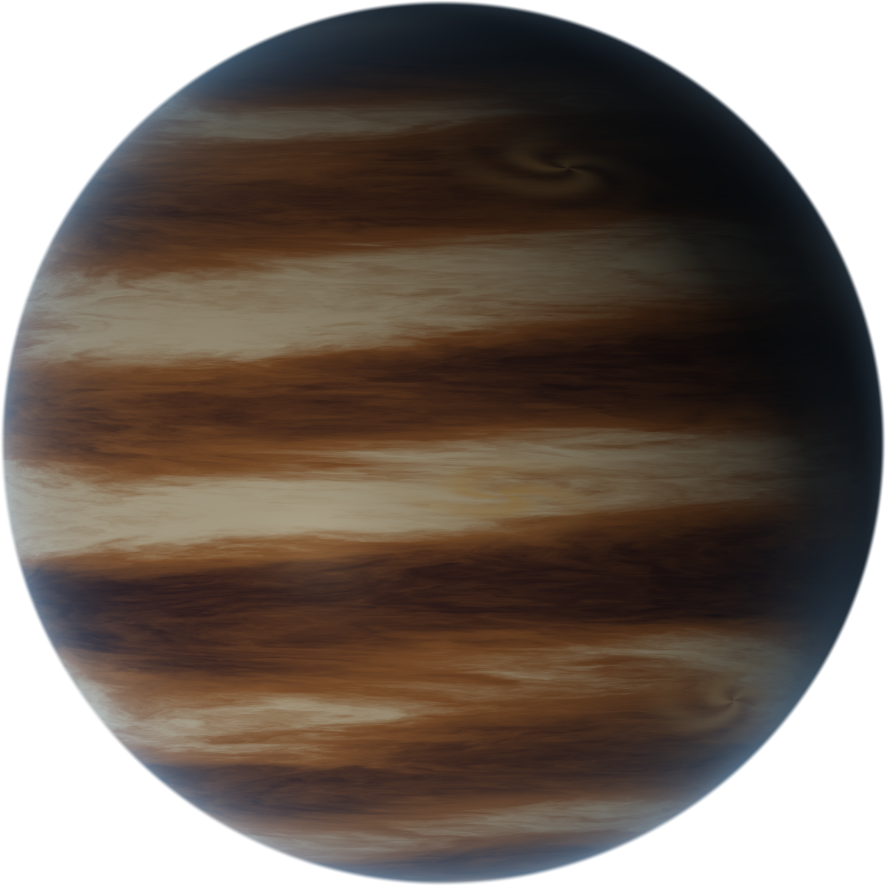
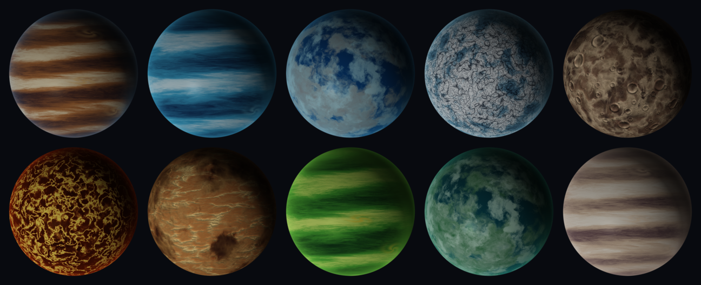
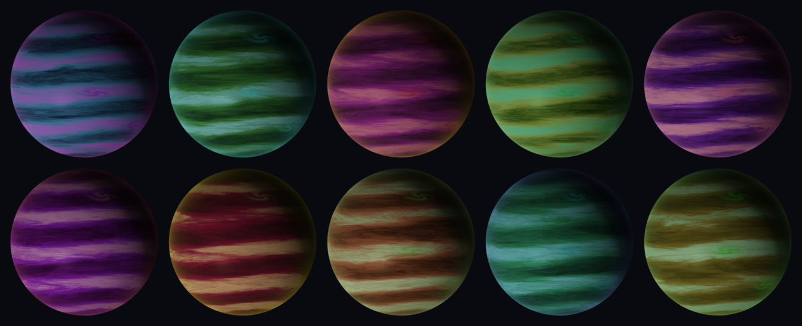
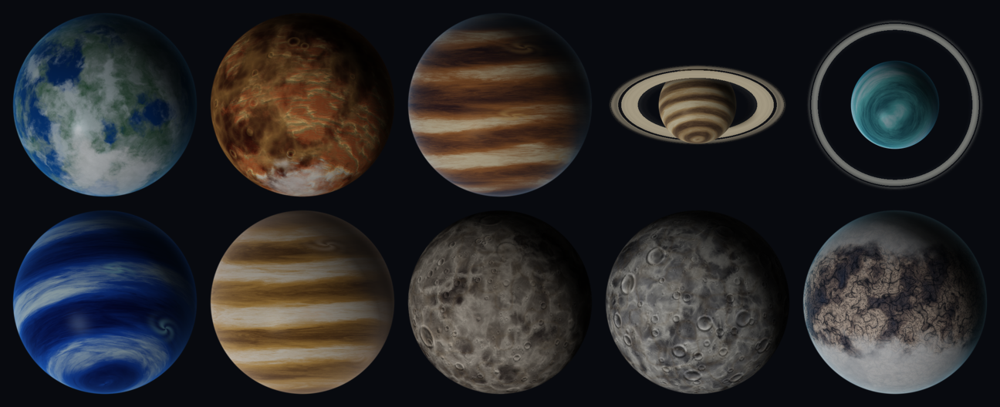
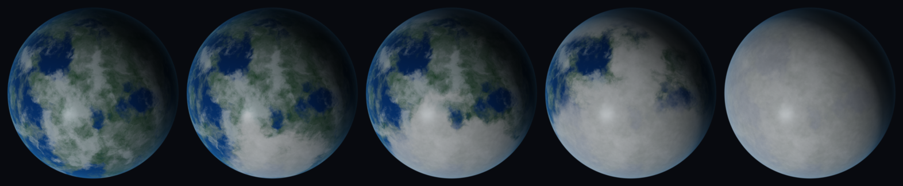
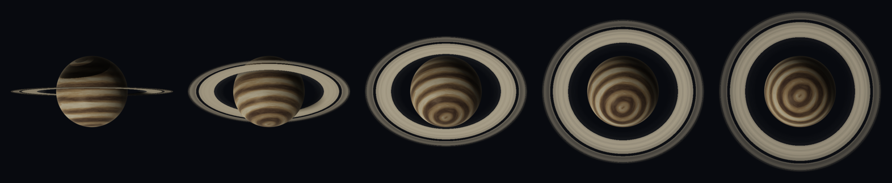
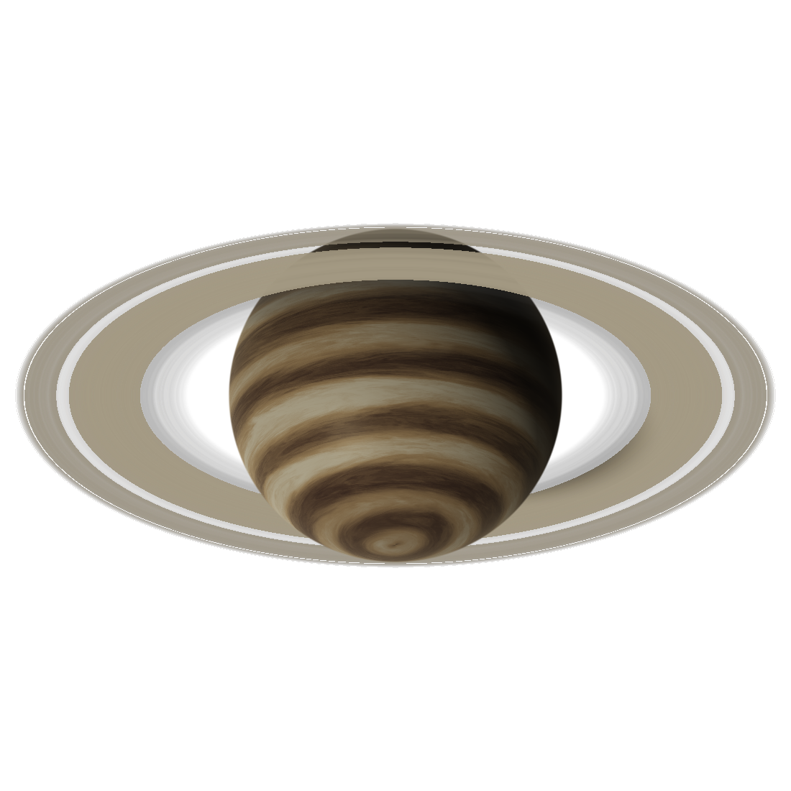

# MoonletPlanet

Procedural planets, drawn by one fragment shader. No mesh, no texture, no asset — a planet
is a struct of two dozen numbers, and the same struct produces the same planet at any size,
on a phone or in a browser.

**Swift and Metal on Apple platforms, TypeScript and WebGL2 on the web.** The Apple side is
the reference: the shader lives there, and the browser's GLSL is *generated from it* rather
than written beside it, so the two cannot drift. Presets and the seeded randomizer are
exported from the Swift definitions for the same reason.

```swift
import MoonletPlanet

MoonletPlanetView(recipe: .preset(.gasGiant))
    .frame(width: 300, height: 300)
```

```ts
import { createPlanetRenderer, solarSystem } from '@moonlet/planet'

createPlanetRenderer(canvas).render(solarSystem.saturn, 18, 400, 400, devicePixelRatio)
```



## Why this exists

I was building [Moonlet](https://moonlet.gokhantopbas.com) — an app for tracking the games,
films, records and books you are waiting for — and its mascot is a small moon that orbits
*your* planet. Which meant everybody needed a planet, every planet had to be different, and
none of them could be a picture.

Shipping images was out: ten kinds of world across every size a phone asks for is a lot of
megabytes for something nobody can customise. A sphere mesh with a texture map was worse —
now there is a seam, a polar pinch, an asset pipeline, and still no way to let someone turn
the storms up.

So the planet became a shader and the planet's *description* became a value: nineteen
numbers, `Codable`, that somebody can keep. It turned out to know nothing about Moonlet at
all, so here it is on its own.

Moonlet has not shipped yet. This has.

## Install

```swift
.package(url: "https://github.com/gkhntpbs/MoonletPlanet.git", from: "1.0.0")
```

iOS 17+, macOS 14+, tvOS 17+, visionOS 1+. Swift 6, strict concurrency. No dependencies.

The web renderer is in [`web/`](web/) and is not on npm yet — see
[web/README.md](web/README.md) for what it does and does not do. It needs WebGL2 and has no
runtime dependencies either.

## Ten archetypes



Gas giant, ice giant, ocean, frozen, rocky, molten, desert, toxic, lush, cloud — each with
animated weather: banded jet streams flowing in opposite directions at different latitudes,
vortex storms, domain-warped turbulence, a soft day/night terminator and an atmospheric rim.

## The recipe is the planet

`MoonletPlanetRecipe` is `Codable`, `Hashable` and `Sendable`. Store one and the planet
comes back; there is nothing else to persist.

```swift
var recipe = MoonletPlanetRecipe.preset(.iceGiant)
recipe.bandCount = 9
recipe.stormStrength = 0.7
recipe.atmosphereGlow = 1.2

let json = try JSONEncoder().encode(recipe)
```

| | |
|---|---|
| `archetype` | which surface function runs — gas, ocean, frozen or rock |
| `seed` | the noise field. The same seed is the same planet, forever |
| `palette` | five colours: highlight, primary, shadow, storm, atmosphere |
| `rotationSpeed`, `cloudSpeed` | how fast the body turns and its weather moves |
| `turbulence`, `detail`, `warpStrength` | how the noise is layered and distorted |
| `bandCount`, `bandSharpness` | the jet streams, for gas giants |
| `stormCount`, `stormStrength` | up to five vortices, placed at fixed latitudes |
| `cloudCoverage`, `atmosphereDensity`, `atmosphereGlow` | the air |
| `roughness`, `featureAmount` | specular falloff and how pronounced terrain is |
| `microDetail` | the fine, high-frequency layer over everything |
| `rotationPhase` | where the planet is in its own day, added to the clock |
| `axialTilt` | the pole, and therefore the angle any rings are seen at |
| `iceCoverage`, `iceAltitude`, `polarAsymmetry` | where it freezes (see below) |
| `lightAzimuth`, `lightElevation`, `exposure` | the star and the tonemap |

Nothing clamps these at runtime — the shader runs millions of times a frame and every guard
costs. Values outside the documented ranges render a planet rather than crashing, just not
one you would choose.

### Random, but reproducible

```swift
let mine = MoonletPlanetRecipe.preset(.gasGiant).randomized(seed: 240513)
```



One archetype, ten seeds. `randomized` replaces the palette from a seeded generator, so
keeping the seed is keeping the planet. That is the entire contract, and it is tested.

### The solar system

```swift
MoonletPlanetView(style: MoonletPlanetPreset.jupiter.style!)
MoonletPlanetView(style: MoonletPlanetPreset.saturn.style!)   // rings included
```



Earth, Mars, Jupiter, Saturn, Uranus, Neptune, Venus, Mercury, Moon, Pluto.

## Ice caps, from where it actually freezes



```swift
var earth = MoonletPlanetPreset.earth.style!.recipe
earth.iceCoverage   // 0.19 — a position for the isotherm, not a cap radius
earth.axialTilt     // 0.409 — 23.4°
```

There is no cap being drawn. The annual mean sunlight a latitude receives is very nearly
`S(φ) ∝ 1 − 0.482·P₂(sin φ)`, the second-Legendre approximation energy balance models use —
about 1.24 at the equator falling to 0.52 at the pole. Ice sits wherever that, minus what
altitude takes away, falls below the freezing isotherm, and `iceCoverage` moves the isotherm.

Doing it that way rather than by drawing a circle is what gives:

- caps with the right **shape** — the isotherm is a curve in latitude, not a small circle, so
  the edge is wide and flat rather than a disc seen in projection
- **highland ice far from the poles**, because `iceAltitude` is a lapse rate. It is why
  Kilimanjaro has snow on the equator
- **two caps that differ**, via `polarAsymmetry`, standing in for the land distribution and
  orbital eccentricity that make Antarctica bigger than the Arctic and Mars's southern cap
  outlast its northern one
- a **snowball** at the top of the range, for free, because that is what the model does when
  the isotherm passes the equator

Gas giants get none of this — there is no ground to freeze. They get the **polar hood** they
really have: darker, greyer, and where the banding gives out.

## Tilt is one number

`axialTilt` is the planet's pole *and* the angle its rings are seen at, because rings lie in
the equatorial plane and those were never two independent settings. Bands, ice and the
daily rotation are computed in the planet's own frame, so a tilted world's weather tilts
with it — Uranus is on its side and looks it.

## Rings, and they are Saturn's



```swift
var recipe = MoonletPlanetRecipe.preset(.gasGiant)
recipe.hasRing = true
recipe.ringTilt = 0.47        // 0 is edge-on, .pi / 2 is face-on
```

The radii are measured rather than invented. The C ring begins at 1.235 planet radii, the
bright B ring runs 1.525 to 1.95, the **Cassini Division** is the near-empty lane from 1.95
to 2.025, and the A ring runs out to 2.27 with the Encke and Keeler gaps cut into it. The
optical depths are Cassini's too — about 0.1 through the C ring and the Division, up to 2.5
across the B ring. `ringInnerRadius` and `ringOuterRadius` *stretch* that anatomy rather
than replacing it, so a narrower system still has a Division in the right place.

The ring plane is the planet's equator and the camera is orthographic, so the intersection
has a closed form: no marching, no second pass, no geometry. What falls out of it is
everything that makes rings read as rings —

- the near arc passes **in front** of the planet and the far arc **behind** it
- the planet casts a **shadow across the rings**, as a cylinder, because the star is far away
- the rings cast a **shadow band on the planet**, carrying the Division across it as a bright stripe
- the **unlit face** is seen by transmitted light, so the thin C ring glows and the thick B
  ring goes dark — the reverse of how they look lit
- the **opposition surge**: rings brighten sharply when the star is behind the observer
- ringlets fade out per-pixel rather than aliasing, so near edge-on there is no moiré



## Turning it

Both workbenches let you drag the planet: sideways turns it through its own day, up and down
tips the pole — the same number that opens the rings. In code that is `rotationPhase` and
`axialTilt`, and neither depends on the clock, so a planet with `rotationSpeed` of zero still
turns when you drag it.

## Still images

A planet frozen at one instant renders identically every time, which is what a thumbnail,
an app icon study or an exported image needs.

```swift
MoonletPlanetView(recipe: recipe, frozenTime: 0)          // one frame, on screen

let cgImage = MoonletPlanetSnapshotRenderer.image(
    recipe: recipe, size: 1024, time: 0
)                                                          // off screen, any size
```

`frozenTime` also stops the display link, so a frozen planet costs nothing to keep on
screen. For reduced motion prefer `timeScale: 0.25` over freezing — the clouds still move,
slowly, instead of the planet becoming a photograph.

Every image in this README is generated by `swift run PlanetGallery`, which writes into
`Documentation/`. A change to the shader is one command away from being visible in the
docs, rather than a picture that quietly stops being true.

## When there is no Metal

`MoonletPlanetView` checks once and falls back to `MoonletPlanetFallback`, a SwiftUI
gradient that keeps the palette and the light direction and loses only the surface detail.
It never crashes and never renders nothing. Ask directly with
`MoonletPlanetRendering.isMetalAvailable`.

## In the browser

`web/` renders the same planets in WebGL2, and nothing in it is written twice: the GLSL is
**generated from the Metal source**, the presets are exported from these Swift definitions,
and the seeded randomizer is held to Swift's output bit for bit by a generated fixture.
`make web-check` fails if any of them have drifted, and CI runs it.

What the web port does not have yet is a convenience view layer — there is no equivalent of
`MoonletPlanetView`, so a caller owns the canvas and the clock. Everything the shader draws
is there: all ten archetypes, rings, ice, tilt.

`make web-studio` opens the same workbench in a browser, rebuilding as you edit, and
`make web-accept` compiles the shader in real headless Chrome and reads back each canvas's
coverage — because a shader that compiles is not a shader that draws. See
[web/README.md](web/README.md).

## How it works

The whole planet is one fragment shader over a four-vertex quad. There is no sphere
geometry: pixels outside the unit circle are discarded and the surface normal is
reconstructed analytically as `z = sqrt(1 - r²)`. Everything visible is then noise
evaluated at that normal — six octaves of value-noise FBM, domain-warped, sampled in 3D
from the sphere normal so there is no seam and no polar pinch, then lit with a Lambert
term, a soft terminator widened by atmospheric density, a rim glow and an exponential
tonemap.

Being fragment-bound rather than geometry-bound is why it costs the same on a phone as a
textured sphere and needs no assets at all.

## Changes

See [CHANGELOG.md](CHANGELOG.md). Versions follow [semver](https://semver.org), and the one
rule that matters here: the recipe is a **stored format**, so a field that changes meaning
or disappears is a major version even when the code still compiles.

## Built with AI, and welcome here

This was written with AI tools — the research behind the shader, most of the code, most of
these words. That is worth saying plainly rather than leaving to be guessed at, and it is not
an apology: the physics is cited, the tests are real, and CI builds it on a machine that is
not the author's.

**Contributions written the same way are welcome.** There is no policy against AI-assisted
patches here and nothing to declare. The bar is the same either way — it has to build, the
tests have to pass, and anything that changes `MoonletPlanetRecipe` has to say so in the
changelog, because somebody's saved planet depends on it. See
[CONTRIBUTING.md](CONTRIBUTING.md).

## Credits

The techniques came from other people's published work. The research that led to this
shader leaned on:

- Inigo Quilez, [domain warping](https://iquilezles.org/articles/warp/) and
  [FBM](https://www.shadertoy.com/view/4dS3Wd) — the noise layering and the warp
- [Parallel Cascades, gas giant curl simulation](https://parallelcascades.com/gas-giant-curl-simulation/)
  — why banded flow needs more than scrolling noise
- Robert Bridson, [Curl-Noise for Procedural Fluid Flow](https://www.cs.ubc.ca/~rbridson/docs/bridson-siggraph2007-curlnoise.pdf) (SIGGRAPH 2007)
- Jan Wedekind, [procedural global cloud cover](https://www.wedesoft.de/software/2023/03/20/procedural-global-cloud-cover/)
  — sampling a flow field tangent to a sphere
- Sebastian Lague, [Solar System](https://github.com/SebLague/Solar-System) and
  [Procedural Planets](https://github.com/SebLague/Procedural-Planets)
- NASA Juno and Hubble observations of Jupiter — that the bands are opposing jet streams
  and the poles carry persistent cyclones, which is why the storms sit where they do

The implementation is original and MIT licensed.

## License

MIT. See [LICENSE](LICENSE).
