# MoonletPlanet

Procedural planets, drawn by one fragment shader. No mesh, no texture, no asset — a planet
is a struct of two dozen numbers, and the same struct produces the same planet at any size,
on a phone or in a browser.

**Swift and Metal on Apple platforms, TypeScript and WebGL2 on the web.** The Apple side is
the reference: the shader lives there, and the browser's GLSL is *generated from it* rather
than written beside it, so the two cannot drift. Presets and the seeded randomizer are
exported from the Swift definitions for the same reason.

```swift
import MoonletPlanet

MoonletPlanetView(recipe: .preset(.gasGiant))
    .frame(width: 300, height: 300)
```

```ts
import { createPlanetRenderer, solarSystem } from '@moonlet/planet'

createPlanetRenderer(canvas).render(solarSystem.saturn, 18, 400, 400, devicePixelRatio)
```

<p align="center">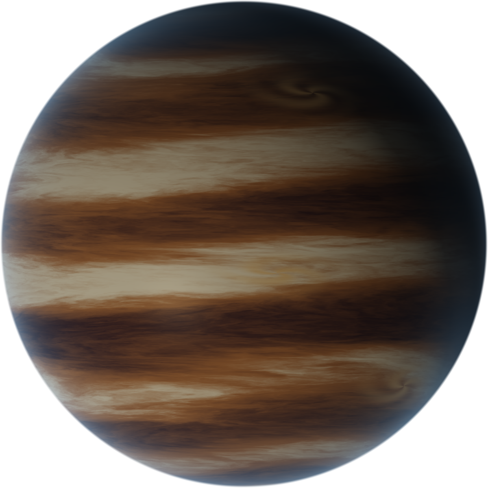</p>

And a star with worlds round it, each lit from where the star is, seen through a camera you
can walk all the way round:

```swift
MoonletSystemView(system: .example)
```

<p align="center">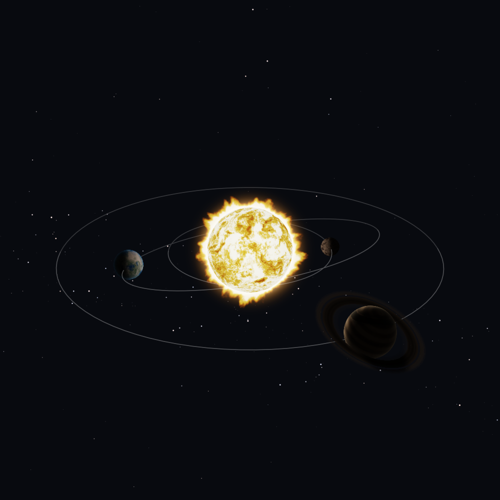</p>

## Why this exists

I was building [Moonlet](https://moonlet.gokhantopbas.com) — an app for tracking the games,
films, records and books you are waiting for — and its mascot is a small moon that orbits
*your* planet. Which meant everybody needed a planet, every planet had to be different, and
none of them could be a picture.

Shipping images was out: ten kinds of world across every size a phone asks for is a lot of
megabytes for something nobody can customise. A sphere mesh with a texture map was worse —
now there is a seam, a polar pinch, an asset pipeline, and still no way to let someone turn
the storms up.

So the planet became a shader and the planet's *description* became a value: nineteen
numbers, `Codable`, that somebody can keep. It turned out to know nothing about Moonlet at
all, so here it is on its own.

Moonlet has not shipped yet. This has.

## Install

```swift
.package(url: "https://github.com/gkhntpbs/MoonletPlanet.git", from: "1.0.0")
```

iOS 17+, macOS 14+, tvOS 17+, visionOS 1+. Swift 6, strict concurrency. No dependencies.

The web renderer is in [`web/`](web/) and is not on npm yet — see
[web/README.md](web/README.md) for what it does and does not do. It needs WebGL2 and has no
runtime dependencies either.

## Eleven archetypes

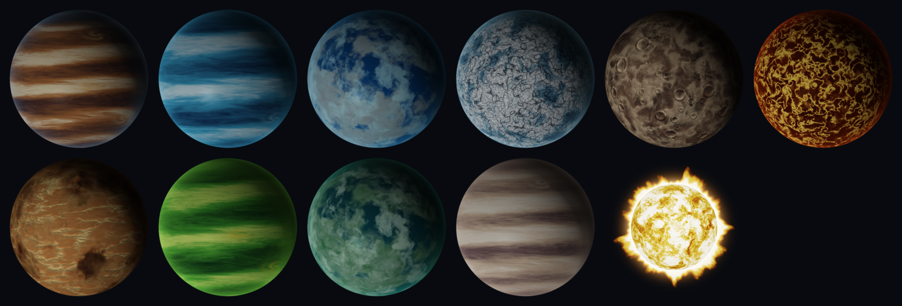

Gas giant, ice giant, ocean, frozen, rocky, molten, desert, toxic, lush, cloud — each with
animated weather: banded jet streams flowing in opposite directions at different latitudes,
vortex storms, domain-warped turbulence, a soft day/night terminator and an atmospheric rim.
And a star, which is not a planet at all but is drawn by the same shader.

## Stars

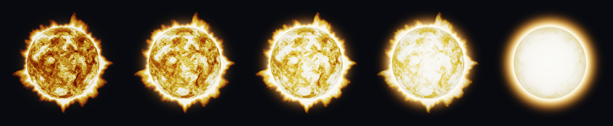

```swift
var star = MoonletPlanetRecipe.preset(.star)    // or MoonletPlanetPreset.sun
star.luminosity = 0.8                           // 0 a ball of fire, 1 nothing but light
```

A star makes its own light rather than reflecting it, so the light controls do nothing to it
and nothing on it is shaded. The surface is plasma folded twice by domain warping and set
moving in two directions at once, so it churns rather than slides; ridged noise on top draws
white-hot veins where the flow converges, against deep red troughs. Flames lick off the limb
— noise in polar coordinates, streaming outward so they rise and break off — and a bloom
sits round it.

The palette is read as a fire ramp here, coolest to hottest: `shadow` deep red, `primary`
orange, `storm` yellow, `highlight` white-hot, and `atmosphere` the glow. `stormCount` is how
many cooler cells it has, `atmosphereGlow` how far the flames reach, `roughness` how thick the
veins are. `luminosity` walks it from fire to light: the texture burns away, the flames go
out and the bloom grows in their place. The flames reach past the disc, so a star's
`drawnExtent` is 1.6.

## The recipe is the planet

`MoonletPlanetRecipe` is `Codable`, `Hashable` and `Sendable`. Store one and the planet
comes back; there is nothing else to persist.

```swift
var recipe = MoonletPlanetRecipe.preset(.iceGiant)
recipe.bandCount = 9
recipe.stormStrength = 0.7
recipe.atmosphereGlow = 1.2

let json = try JSONEncoder().encode(recipe)
```

| | |
|---|---|
| `archetype` | which surface function runs — gas, ocean, frozen or rock |
| `seed` | the noise field. The same seed is the same planet, forever |
| `palette` | five colours: highlight, primary, shadow, storm, atmosphere |
| `rotationSpeed`, `cloudSpeed` | how fast the body turns and its weather moves |
| `turbulence`, `detail`, `warpStrength` | how the noise is layered and distorted |
| `bandCount`, `bandSharpness` | the jet streams, for gas giants |
| `stormCount`, `stormStrength` | up to five vortices, placed at fixed latitudes |
| `cloudCoverage`, `atmosphereDensity`, `atmosphereGlow` | the air |
| `roughness`, `featureAmount` | specular falloff and how pronounced terrain is |
| `microDetail` | the fine, high-frequency layer over everything |
| `rotationPhase` | where the planet is in its own day, added to the clock |
| `axialTilt` | the pole, and therefore the angle any rings are seen at |
| `iceCoverage`, `iceAltitude`, `polarAsymmetry` | where it freezes (see below) |
| `lightAzimuth`, `lightElevation`, `exposure` | the star and the tonemap |
| `dayNightSpeed` | the star sweeping round, so the terminator moves |
| `life`, `station…` | whether anything lives here, and what it has put in orbit (see below) |
| `ringOpacity`, `ringInnerRadius`, `ringOuterRadius`, `ringDetail` | the rings |
| `luminosity` | stars only: how much it burns and how much it shines |
| `roll` | turns the drawn body on screen; a system sets it, 0 is upright |

Nothing clamps these at runtime — the shader runs millions of times a frame and every guard
costs. Values outside the documented ranges render a planet rather than crashing, just not
one you would choose.

### Random, but reproducible

```swift
let mine = MoonletPlanetRecipe.preset(.gasGiant).randomized(seed: 240513)
```

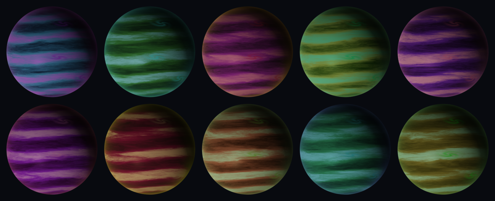

One archetype, ten seeds. `randomized` replaces the palette from a seeded generator, so
keeping the seed is keeping the planet. That is the entire contract, and it is tested.

### The solar system

```swift
MoonletPlanetView(style: MoonletPlanetPreset.jupiter.style!)
MoonletPlanetView(style: MoonletPlanetPreset.saturn.style!)   // rings included
```

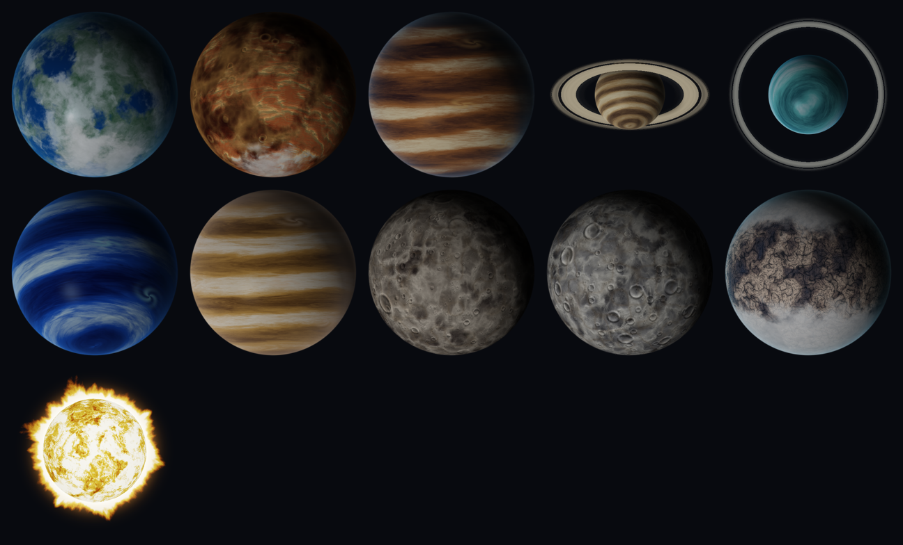

Earth, Mars, Jupiter, Saturn, Uranus, Neptune, Venus, Mercury, Moon, Pluto — and the Sun.

## Ice caps, from where it actually freezes

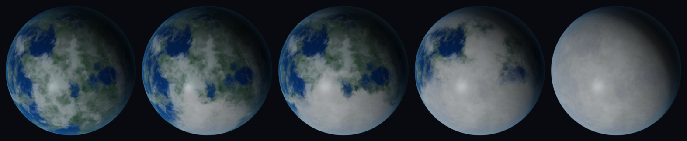

```swift
var earth = MoonletPlanetPreset.earth.style!.recipe
earth.iceCoverage   // 0.19 — a position for the isotherm, not a cap radius
earth.axialTilt     // 0.409 — 23.4°
```

There is no cap being drawn. The annual mean sunlight a latitude receives is very nearly
`S(φ) ∝ 1 − 0.482·P₂(sin φ)`, the second-Legendre approximation energy balance models use —
about 1.24 at the equator falling to 0.52 at the pole. Ice sits wherever that, minus what
altitude takes away, falls below the freezing isotherm, and `iceCoverage` moves the isotherm.

Doing it that way rather than by drawing a circle is what gives:

- caps with the right **shape** — the isotherm is a curve in latitude, not a small circle, so
  the edge is wide and flat rather than a disc seen in projection
- **highland ice far from the poles**, because `iceAltitude` is a lapse rate. It is why
  Kilimanjaro has snow on the equator
- **two caps that differ**, via `polarAsymmetry`, standing in for the land distribution and
  orbital eccentricity that make Antarctica bigger than the Arctic and Mars's southern cap
  outlast its northern one
- a **snowball** at the top of the range, for free, because that is what the model does when
  the isotherm passes the equator

Gas giants get none of this — there is no ground to freeze. They get the **polar hood** they
really have: darker, greyer, and where the banding gives out.

## Tilt is one number

`axialTilt` is the planet's pole *and* the angle its rings are seen at, because rings lie in
the equatorial plane and those were never two independent settings. Bands, ice and the
daily rotation are computed in the planet's own frame, so a tilted world's weather tilts
with it — Uranus is on its side and looks it.

## Life, if there is any

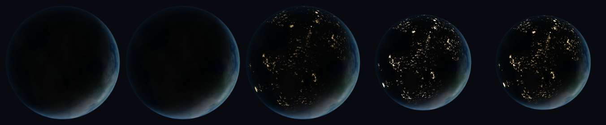

```swift
var earth = MoonletPlanetPreset.earth.style!.recipe
earth.life = .complex          // .none .simple .complex .advanced .interplanetary
earth.dayNightSpeed = 0.25     // so there is a night for it to show on
```

Five ordered levels, sterile by default, each the one before it plus something.

**`.simple`** is the one worth getting right. Nothing built and nothing lit — just land gone
faintly green where it is low and wet, because that is where water collects. It is the
difference between Mars and a Mars with lichen on it, and it shows in daylight rather than at
night.

**`.complex`** puts cities on the night side. What makes them read as cities rather than as
speckle is where they are *not*: never on water, thinning inland because population follows
coasts, and clustered at three scales — which regions are settled at all, the cities in them,
the towns between. A civilisation that has just learned to light its streets does not light
all of them, so this level reaches less far than the next.

**`.advanced`** lights the rest of it and puts something in orbit.

**`.interplanetary`** comes and goes. Now and then something lifts off the ground or comes
back down to it, and it is light and nothing else: the pad blooms orange, a hot core with a
halo climbs off the edge of the world in a gravity turn with a flickering plume behind it,
and goes over into orbit; a descent is the same arc backwards, whiter, brightest where the
air is thick. A hull was tried and looked like a toy rocket stuck to the limb — at these
sizes a drawn ship is a cartoon, and what reads as a ship is the light it makes. Launches
are seen from the limb, in profile, because the camera looks straight at the disc and a
rocket climbing out of the middle of it climbs towards the lens and does not move on screen
at all. A flight comes every twenty seconds or so and most cycles are quiet — a launch every
few seconds is an airport, and what is wanted is the occasional one that makes somebody look
twice. Which pad, which way and whether it is going up or coming down are the seed's, like
the coastlines. Ships need ground to leave, so a gas giant has none.

The lights are emission added before the tonemap, so they bloom the way a bright thing does,
and they come up through the last of the dusk rather than switching on at the terminator.

### The station

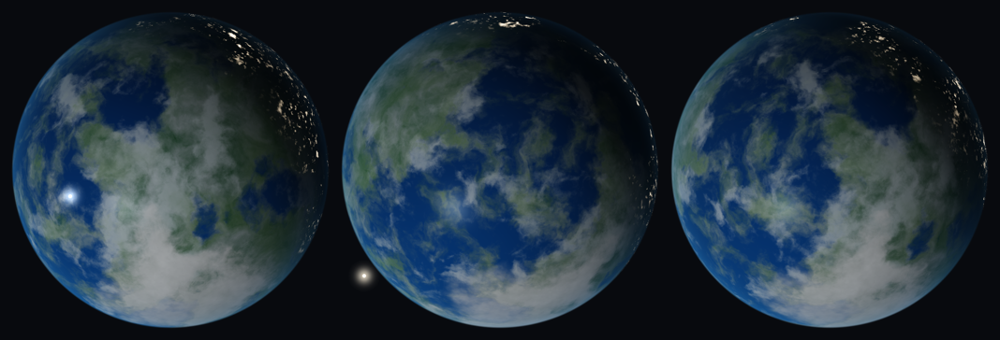

A great circle inclined to the planet's own equator — not to the screen, which would stop it
agreeing with the world it goes round the moment the planet is tilted. The inclination is
roughly the one the ISS flies. It is hidden behind the planet, and it goes out in eclipse,
which is what a satellite does when it crosses into the shadow.

Its ascending node drifts, because real orbits precess and because without that it traces one
ellipse for ever: a planet tilted like Earth's shows a nearly face-on orbit that never
transits at all. With the node moving, the plane turns edge-on and back, so the station
crosses the disc sometimes and rides the limb the rest of the time.

It is drawn as three things, because a bright dot on its own reads as a lens flare. The body
is a hub with a bar across it — solar arrays held along the orbit normal, the way the ISS
truss is — and it is a silhouette: over the day side it is a dark speck with a glint in it,
which is how a transit actually looks, and over space the glint is all there is. The glint is
a hard core with four screen-aligned spikes rather than a halo, so it reads as a specular
point. Behind it a short trail along the orbit is what makes a moving thing read as moving in
a still frame; it is cut at the limb where the station just came out.

```swift
recipe.stationCount = 2            // 0 turns them off; one by default
recipe.stationOrbitRadius = 1.3    // planet radii; 1.085 crosses the disc rather than skirting it
recipe.stationSpeed = 0.4          // radians a second; precession follows it
recipe.stationInclination = 0.9    // to the equator; ~51°, as the ISS flies
recipe.stationSize = 1.5           // a multiplier, and never below a pixel
```

More than one share the orbit's radius, speed and inclination but not its plane or its
phase — spaced evenly around one circle they would read as beads on a string. The canvas
zooms out to hold whatever orbit is set, so `drawnExtent` on the recipe is what a view
should divide by when it sizes the body against a square.

## A day that passes

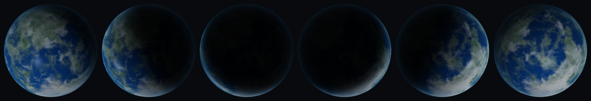

```swift
recipe.dayNightSpeed = 0.3     // radians a second; 0 holds the light still
```

This moves the **terminator** — the planet running through its phases — which is a different
thing from `rotationSpeed`, which turns the ground under a light that stays put. A world with
both has ground that travels into its own night, which is what makes city lights appear as
land rotates away from the star rather than switch on where they already are.

## Rings, and they are Saturn's

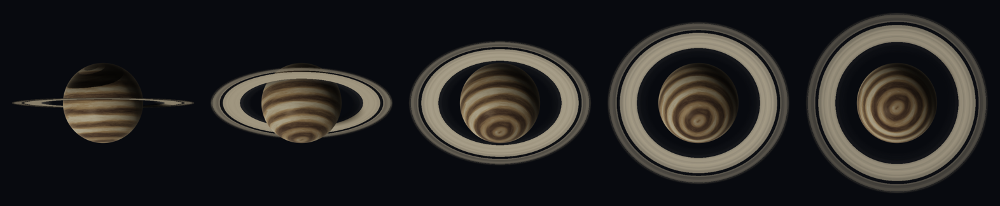

```swift
var recipe = MoonletPlanetRecipe.preset(.gasGiant)
recipe.hasRing = true
recipe.axialTilt = 0.47       // the pole, and so the rings: 0 is edge-on, .pi / 2 face-on
```

The radii are measured rather than invented. The C ring begins at 1.235 planet radii, the
bright B ring runs 1.525 to 1.95, the **Cassini Division** is the near-empty lane from 1.95
to 2.025, and the A ring runs out to 2.27 with the Encke and Keeler gaps cut into it. The
optical depths are Cassini's too — about 0.1 through the C ring and the Division, up to 2.5
across the B ring. `ringInnerRadius` and `ringOuterRadius` *stretch* that anatomy rather
than replacing it, so a narrower system still has a Division in the right place.

The ring plane is the planet's equator and the camera is orthographic, so the intersection
has a closed form: no marching, no second pass, no geometry. What falls out of it is
everything that makes rings read as rings —

- the near arc passes **in front** of the planet and the far arc **behind** it
- the planet casts a **shadow across the rings**, as a cylinder, because the star is far away
- the rings cast a **shadow band on the planet**, carrying the Division across it as a bright stripe
- the **unlit face** is seen by transmitted light, so the thin C ring glows and the thick B
  ring goes dark — the reverse of how they look lit
- the **opposition surge**: rings brighten sharply when the star is behind the observer
- ringlets fade out per-pixel rather than aliasing, so near edge-on there is no moiré

<p align="center">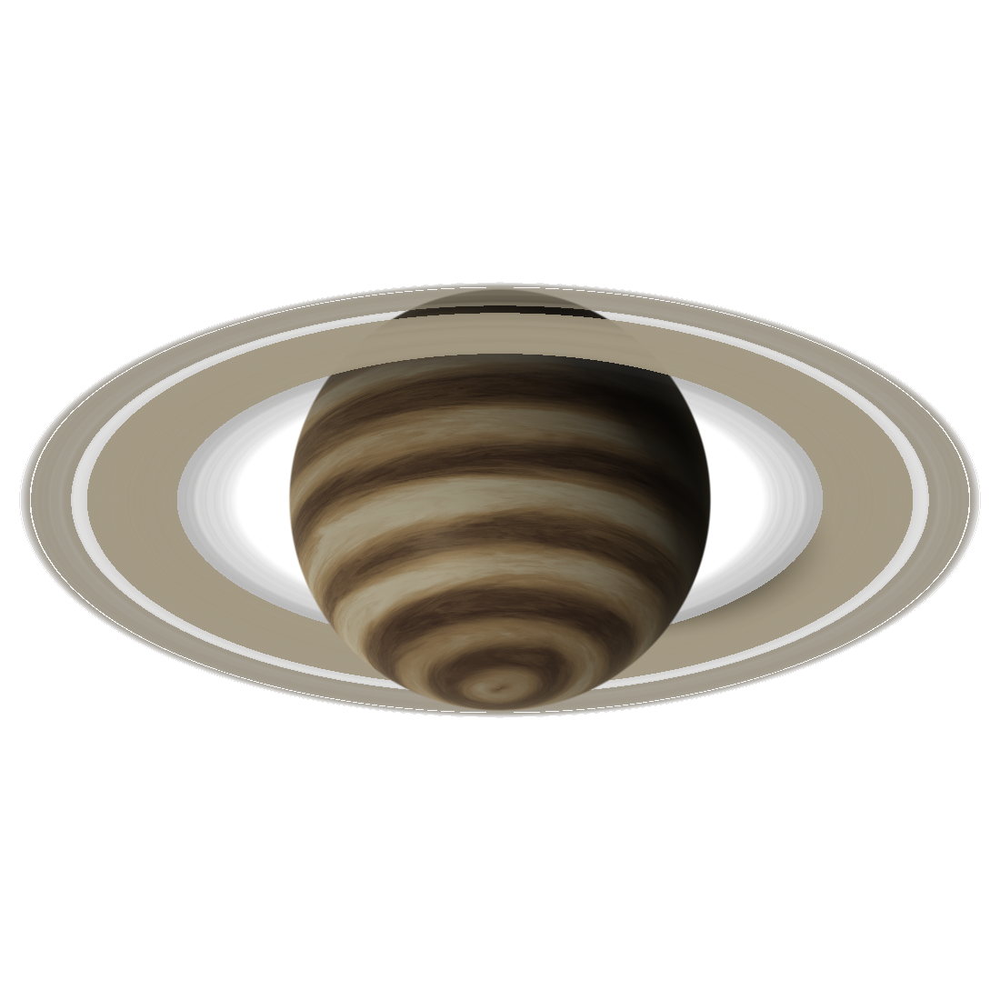</p>

## A system of your own

```swift
var system = MoonletPlanetSystem(star: MoonletPlanetPreset.sun.style!.recipe)
system.bodies = [
    .init(recipe: MoonletPlanetPreset.earth.style!.recipe, radius: 0.36, distance: 3, phase: 0.4, speed: 0.13),
    .init(recipe: MoonletPlanetPreset.saturn.style!.recipe, radius: 0.5, distance: 4.4, speed: 0.07,
          inclination: 0.25, node: 1.2),
]
system.perspective = 0.8        // a real camera; 0 is flat
system.showsOrbits = true
system.sky.isVisible = true

MoonletSystemView(system: system)
```

A planet on its own is lit by two numbers somebody chose. In a system nobody chooses them:
they are the direction from the planet to its star, so a world passing in front of its star
shows its night side and one beside it is half lit. The planets' own recipes are never
changed — `layout(at:)` hands back lit copies — so a planet taken out of a system is the same
planet it was before it went in. Everything is in one unit, the system's own: the star's
radius, each planet's radius and each orbit's distance.

**A real camera.** With `perspective` above zero nearer worlds are larger and further ones
smaller, orbits narrow towards the back, and the camera walks all the way round the system
(`viewAzimuth`) and over and under it (`viewElevation`). Every body keeps its pole, its rings
and its face fixed in the system while it does — Saturn's rings open as the camera rises and
close as it comes level, and lean the other way from the other side. The shader can only
lean a pole towards or away from the camera, so a sideways lean is `roll`, applied inside
the shader with the light turned back to match. Behind it all, a sky of stars at infinity
turns with the camera, which is what tells the eye the camera is moving and not the planets.

Everything about it is a setting, and every setting defaults to what was drawn before it
existed:

| | |
|---|---|
| `viewAzimuth`, `viewElevation`, `perspective`, `zoom` | the camera |
| `lightTint`, `lightFalloff` | how much the worlds take the star's colour, and dim with distance |
| `orbitSpeed`, `showsOrbits`, `orbitStyle` | every orbit's speed at once, and the orbit lines |
| `sky` | stars: count, `seed`, brightness, size, colour and its range, `twinkle`, and a Milky Way band |
| each orbit's `distance`, `radius`, `phase`, `speed` | where it is and how fast it goes; speed 0 holds it still |
| each orbit's `inclination`, `node` | tipping it out of the plane, and where it crosses it |

`place(_:atX:y:time:)` puts a planet under a point on screen, which is how both workbenches
let you drag one into place; `MoonletPlanetSnapshotRenderer.image(system:size:time:)` renders
a system off screen.

The workbenches have a **System** mode with every one of these on a slider. Drag a planet to
move it, drag empty space to turn the camera — it coasts when you let go — and pinch or
scroll to zoom.

## Turning it

Both workbenches let you drag the planet: sideways turns it through its own day, up and down
tips the pole — the same number that opens the rings. In code that is `rotationPhase` and
`axialTilt`, and neither depends on the clock, so a planet with `rotationSpeed` of zero still
turns when you drag it.

## Still images

A planet frozen at one instant renders identically every time, which is what a thumbnail,
an app icon study or an exported image needs.

```swift
MoonletPlanetView(recipe: recipe, frozenTime: 0)          // one frame, on screen

let cgImage = MoonletPlanetSnapshotRenderer.image(
    recipe: recipe, size: 1024, time: 0
)                                                          // off screen, any size
```

`frozenTime` also stops the display link, so a frozen planet costs nothing to keep on
screen. For reduced motion prefer `timeScale: 0.25` over freezing — the clouds still move,
slowly, instead of the planet becoming a photograph.

Every image in this README is generated by `swift run PlanetGallery`, which writes into
`Documentation/`. A change to the shader is one command away from being visible in the
docs, rather than a picture that quietly stops being true.

## When there is no Metal

`MoonletPlanetView` checks once and falls back to `MoonletPlanetFallback`, a SwiftUI
gradient that keeps the palette and the light direction and loses only the surface detail.
It never crashes and never renders nothing. Ask directly with
`MoonletPlanetRendering.isMetalAvailable`.

## In the browser

`web/` renders the same planets in WebGL2, and nothing in it is written twice: the GLSL is
**generated from the Metal source**, the presets are exported from these Swift definitions,
and the seeded randomizer is held to Swift's output bit for bit by a generated fixture.
`make web-check` fails if any of them have drifted, and CI runs it.

What the web port does not have yet is a convenience view layer — there is no equivalent of
`MoonletPlanetView`, so a caller owns the canvas and the clock. Everything the shader draws
is there: all eleven archetypes, stars, rings, ice, tilt, life.

Systems are there too, with every setting the Swift side has:

```ts
import { createPlanetRenderer, systemExample } from '@moonlet/planet'

const system = { ...systemExample, perspective: 0.8, showsOrbits: true }
createPlanetRenderer(canvas).renderSystem(system, time, width, height, devicePixelRatio, { showsStarfield: true })
```

`layoutSystem` is a port of `layout(at:)` and is held to it by a fixture the Swift side
writes — every planet in the same place, lit from the same side, turned the same way, with
the same sky behind it.

`make web-studio` opens the same workbench in a browser, rebuilding as you edit — and
`dev/system.html` in it is the system workbench — and
`make web-accept` compiles the shader in real headless Chrome and reads back each canvas's
coverage — because a shader that compiles is not a shader that draws. See
[web/README.md](web/README.md).

## How it works

The whole planet is one fragment shader over a four-vertex quad. There is no sphere
geometry: pixels outside the unit circle are discarded and the surface normal is
reconstructed analytically as `z = sqrt(1 - r²)`. Everything visible is then noise
evaluated at that normal — six octaves of value-noise FBM, domain-warped, sampled in 3D
from the sphere normal so there is no seam and no polar pinch, then lit with a Lambert
term, a soft terminator widened by atmospheric density, a rim glow and an exponential
tonemap.

Being fragment-bound rather than geometry-bound is why it costs the same on a phone as a
textured sphere and needs no assets at all.

## Changes

See [CHANGELOG.md](CHANGELOG.md). Versions follow [semver](https://semver.org), and the one
rule that matters here: the recipe is a **stored format**, so a field that changes meaning
or disappears is a major version even when the code still compiles.

## Built with AI, and welcome here

This was written with AI tools — the research behind the shader, most of the code, most of
these words. That is worth saying plainly rather than leaving to be guessed at, and it is not
an apology: the physics is cited, the tests are real, and CI builds it on a machine that is
not the author's.

**Contributions written the same way are welcome.** There is no policy against AI-assisted
patches here and nothing to declare. The bar is the same either way — it has to build, the
tests have to pass, and anything that changes `MoonletPlanetRecipe` has to say so in the
changelog, because somebody's saved planet depends on it. See
[CONTRIBUTING.md](CONTRIBUTING.md).

## Credits

The techniques came from other people's published work. The research that led to this
shader leaned on:

- Inigo Quilez, [domain warping](https://iquilezles.org/articles/warp/) and
  [FBM](https://www.shadertoy.com/view/4dS3Wd) — the noise layering and the warp
- [Parallel Cascades, gas giant curl simulation](https://parallelcascades.com/gas-giant-curl-simulation/)
  — why banded flow needs more than scrolling noise
- Robert Bridson, [Curl-Noise for Procedural Fluid Flow](https://www.cs.ubc.ca/~rbridson/docs/bridson-siggraph2007-curlnoise.pdf) (SIGGRAPH 2007)
- Jan Wedekind, [procedural global cloud cover](https://www.wedesoft.de/software/2023/03/20/procedural-global-cloud-cover/)
  — sampling a flow field tangent to a sphere
- Sebastian Lague, [Solar System](https://github.com/SebLague/Solar-System) and
  [Procedural Planets](https://github.com/SebLague/Procedural-Planets)
- NASA Juno and Hubble observations of Jupiter — that the bands are opposing jet streams
  and the poles carry persistent cyclones, which is why the storms sit where they do

The implementation is original and MIT licensed.

## License

MIT. See [LICENSE](LICENSE).
